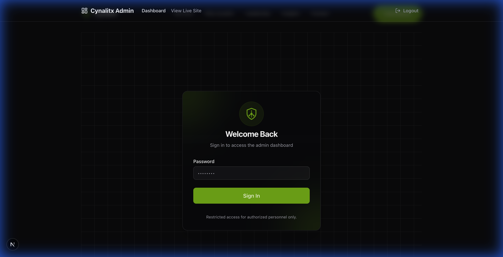

# Cyberlix User Guide

This guide explains how to manage the content, leadership team, and insights (blog posts) of the Cyberlix website.

## Table of Contents

- [Content Management](#content-management)
- [Managing Leadership Team](#managing-leadership-team)
- [Managing Insights (Blog)](#managing-insights-blog)
- [Development Commands](#development-commands)

---

## Content Management

All the text content on the website is managed via a central content file.

**File Location:** `frontend/src/content/index.js`

### How to Update Content

1.  Open the `frontend/src/content/index.js` file.
2.  Locate the section you want to edit (e.g., `home`, `about`, `contact`).
3.  Update the text values inside the quotes.
4.  Save the file.
5.  Commit and push your changes to see them live.

**Example:**

To update the "Contact Us" email in the footer:

```javascript
"contact": {
    "title": "Contact",
    "address": "123 Security Way, Tech City, TC 90210",
    "phone": "+1 (555) 123-4567",
    "email": "contact@cyberlix.com", // Update this line
    "defaultEmail": "support@cyberlix.com",
    "social": {
      "linkedIn": "https://linkedin.com/company/cyberlix",
      "twitter": "https://twitter.com/cyberlix"
    }
}
```




### Admin Dashboard
Once logged in, you will see the Dashboard, which lists all existing posts.


### Creating a New Insight
1.  Click the **"Create Post"** button on the top right of the Dashboard.
2.  Fill in the form:
    *   **Title**: The headline of the article.
    *   **Slug**: URL-friendly version of the title (auto-generated usually, or manual).
    *   **Author**: Select the author.
    *   **Category**: Choose a category (e.g., Industry Trends).
    *   **Content**: Write your post using the Markdown editor.
    *   **Cover Image**: Upload or provide a URL for the post header image.
3.  Click **"Publish"** to make it live immediately, or **"Save Draft"**.

### Editing an Insight
1.  On the Dashboard, locate the post you wish to modify.
2.  Click the **Pencil Icon** (Edit) next to the post.
3.  Update the content and click **"Save Changes"**.

### Deleting an Insight
1.  On the Dashboard, locate the post to remove.
2.  Click the **Trash Icon** (Delete).
3.  Confirm the deletion when prompted. **This action cannot be undone.**
