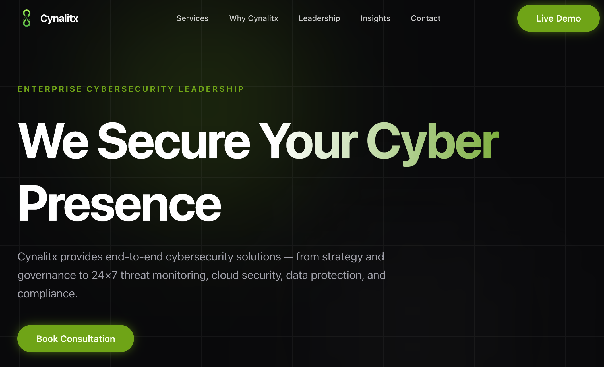

# Cyberlix - Next-Gen Cybersecurity Platform



## 🛡️ Mission Protocol

**Cyberlix** is a cutting-edge digital defense platform architected to secure enterprise infrastructure in the quantum era. This repository houses the frontend interface for Cyberlix's suite of security services, ranging from autonomous SOC operations to strategic vCISO governance.

We fuse advanced AI threat detection with battle-tested human intellect to build resilient, compliant, and growth-ready enterprises.

---

## ⚡ Tech Stack

This project is built on a modern, high-performance stack designed for speed, SEO, and scalability:

*   **Framework**: [Next.js 14+](https://nextjs.org/) (App Router)
*   **Styling**: [Tailwind CSS](https://tailwindcss.com/)
*   **UI Components**: [Shadcn/ui](https://ui.shadcn.com/)
*   **Icons**: [Lucide React](https://lucide.dev/)
*   **Animations**: [Framer Motion](https://www.framer.com/motion/)
*   **Database (ORM)**: [Prisma](https://www.prisma.io/)
*   **Content Management**: Local JSON/TS based CMS for rapid iteration.

---

## 🚀 Getting Started

### Prerequisites

Ensure you have the following installed on your local machine:
*   **Node.js** (v18 or higher)
*   **npm** or **yarn** or **pnpm**
*   **Git**

### Installation

1.  **Clone the Repository**
    ```bash
    git clone https://github.com/your-username/cyberlix.git
    cd cyberlix
    ```

2.  **Install Dependencies**
    Navigate to the frontend directory and install the necessary packages.
    ```bash
    cd frontend
    npm install
    ```

3.  **Environment Setup**
    Create a `.env` file in the `frontend` root (copy from `.env.example` if available) and configure your database connection strings if running locally.
    ```bash
    cp .env.example .env
    ```

4.  **Run Development Server**
    ```bash
    npm run dev
    ```
    The application will deploy locally at `http://localhost:3000`.

---

## 🔐 Environment Variables

Create a `.env` file in the `frontend` directory with the following variables:

| Variable | Description | Required |
| :--- | :--- | :--- |
| `DATABASE_URL` | Connection string for your database (e.g., PostgreSQL/MySQL). | Yes |
| `ADMIN_PASSWORD` | Password to access the `/admin` dashboard. | Yes |
| `EMAIL_SMTP_HOST` | Hostname for your SMTP provider. | Yes (for contact form) |
| `EMAIL_SMTP_USER` | Username/Email for SMTP authentication. | Yes (for contact form) |
| `EMAIL_SMTP_PASS` | Password for SMTP authentication. | Yes (for contact form) |
| `EMAIL_SMTP_PORT` | Port for SMTP (default: 465). | No |
| `EMAIL_SMTP_SECURE`| Use TLS? (true/false, default: true). | No |
| `EMAIL_FROM` | Email address to send emails from. | No |
| `NEXT_PUBLIC_SUPPORT_EMAIL` | Destination email for contact form submissions. | No |

---

## 🕹️ Admin Dashboard

Cyberlix includes a built-in administration panel for managing blog posts ("Insights") and viewing other system statuses.

**Access Protocol:**
1.  Navigate to `/admin` (e.g., `http://localhost:3000/admin`).
2.  Enter the password configured in your `ADMIN_PASSWORD` environment variable.
3.  Upon authentication, you will gain access to the **Command Center** where you can:
    *   Create, Edit, and Delete "Insight" articles.
    *   Manage content drafts.

---

## 📝 Content Management

Cyberlix uses a **Headless-style Local CMS** approach to manage site content without touching the core codebase.

**Control Center:** `frontend/src/content/index.js`

All text, leadership profiles, service descriptions, and contact info are stored in this central file.

### How to Edit Content:
1.  Open `frontend/src/content/index.js`.
2.  Locate the key you wish to change (e.g., `home.hero.title`).
3.  Update the text string.
4.  Save the file. The site will hot-reload with your changes instantly.

**Example - Changing the Hero Title:**
```javascript
export const home = {
    "hero": {
        "title": "New Title Goes Here", // Edit this line
        ...
    }
}
```


### Deleting an Insight
1.  On the Dashboard, locate the post to remove.
2.  Click the **Trash Icon** (Delete).
3.  Confirm the deletion when prompted. **This action cannot be undone.**
